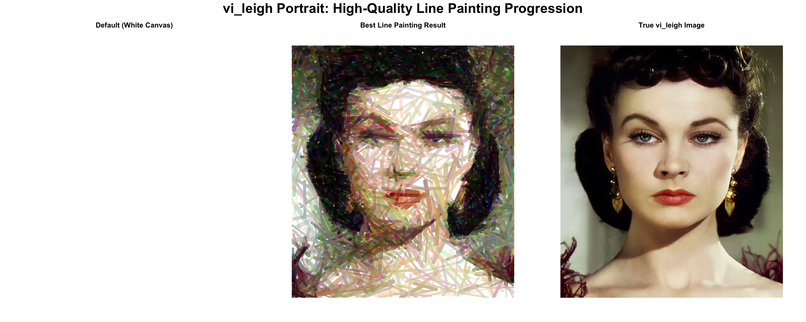
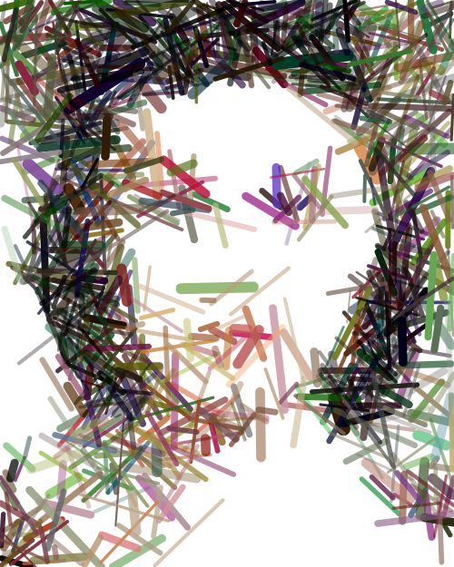
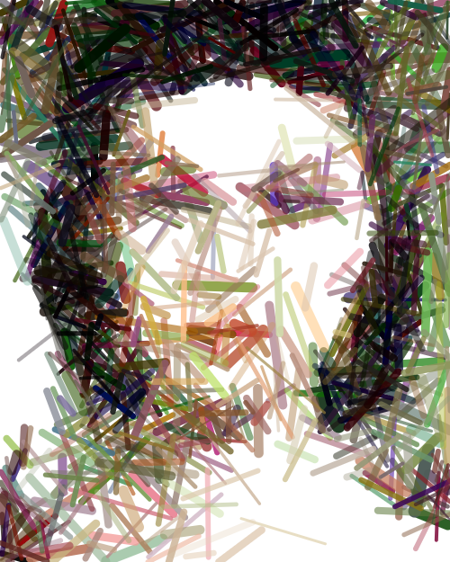
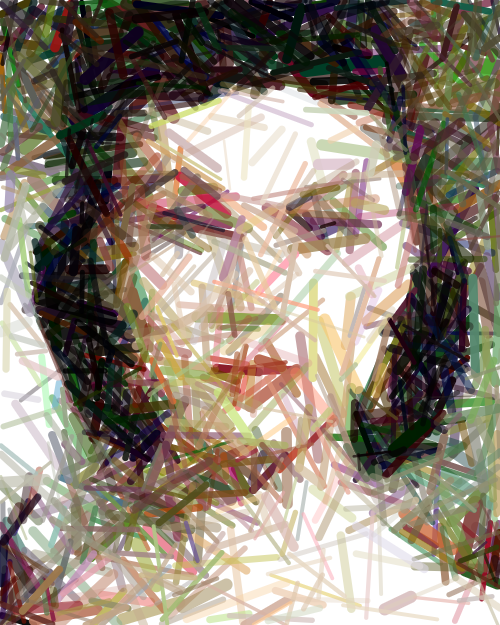
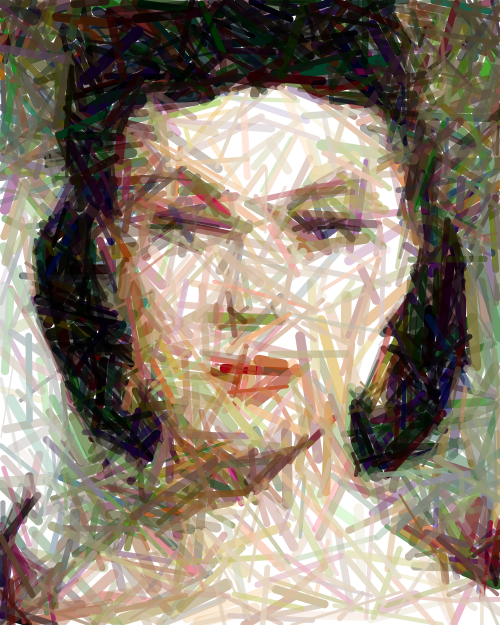

# mcmcPainter

**MCMC-Based Artistic Line and Dot Painting Generation**

Transform any image into line-based or pointillism-style artwork using Reversible Jump MCMC algorithms. This R package combines statistical optimization with digital art generation to create stunning artistic interpretations of photographs.

## Visual Example

Here's an example of the MCMC line painting algorithm in action, showing the complete transformation from a white canvas to a detailed portrait:



*Complete progression from white canvas to final artwork over 100,000 iterations*

## Overview

`mcmcPainter` uses advanced Markov Chain Monte Carlo (MCMC) techniques to iteratively build artwork by adding, removing, and modifying artistic elements (lines or dots) until the result closely matches a target image. The algorithm intelligently explores the space of possible artworks, gradually improving the match through statistical optimization.

## Key Features

- **🎨 Dual Art Styles**: Generate both line-based and dot-based (pointillism) artwork
- **⚡ High Performance**: C++ optimized core functions for fast MCMC sampling
- **🖼️ Flexible Input**: Supports various image formats (PNG, JPEG, etc.)
- **📐 Smart Scaling**: Automatic image analysis and parameter optimization
- **📊 Progress Tracking**: Saves intermediate results every N iterations
- **🎯 Quality Control**: PNG verification and intelligent parameter tuning
- **📦 Professional Package**: Full R package structure with comprehensive documentation

## Installation

```r
# Install dependencies
install.packages(c("Rcpp", "magick", "png", "knitr", "rmarkdown"))

# Clone the repository
# git clone https://github.com/davidhodgson/mcmcPainter.git

# Load the package
source("R/mcmcPainter.R")
source("R/mcmc_core.R") 
source("R/utilities.R")

# Compile C++ code
Rcpp::sourceCpp("src/mcmc_painter_cpp.cpp")
```

## Quick Start

### Line Painting

```r
# Generate line painting
res <- run_line_painter(
  image_path = "inst/extdata/leaf_converted.png",
  iters = 10000,
  out_dir = "inst/results/my_artwork"
)

# Create visualization
create_triptych(
  default_canvas = array(1, dim = c(800, 1422, 3)),
  best_canvas = res$best$canvas,
  target_img = load_image_rgb("inst/extdata/leaf_converted.png", 800, 1422)
)
```

### Dot Painting (Pointillism)

```r
# Generate dot painting
res <- run_dot_painter(
  image_path = "inst/extdata/leaf_converted.png",
  iters = 10000,
  out_dir = "inst/results/my_dot_artwork"
)

# Create dot triptych
create_dot_triptych(
  default_canvas = array(1, dim = c(800, 1422, 3)),
  best_canvas = res$best$canvas,
  target_img = load_image_rgb("inst/extdata/leaf_converted.png", 800, 1422)
)
```

## How It Works

### The MCMC Algorithm

The package implements a Reversible Jump MCMC algorithm with four types of moves:

1. **Birth**: Add new artistic elements (lines or dots) based on image residuals
2. **Death**: Remove existing elements
3. **Jitter**: Perturb element parameters (position, color, opacity, size)
4. **Swap**: Reorder element rendering for better composition

### Line Painting Algorithm

For line-based artwork, each line is defined by:
- **Position**: Start and end coordinates (x1, y1, x2, y2)
- **Color**: RGB values (r, g, b)
- **Opacity**: Alpha transparency (0-1)
- **Thickness**: Line width in pixels

The algorithm uses data-driven birth proposals, sampling new lines from areas with high image residuals to focus on important features.

### Dot Painting Algorithm

For pointillism-style artwork, each dot is defined by:
- **Position**: Center coordinates (x, y)
- **Color**: RGB values (r, g, b)
- **Opacity**: Alpha transparency (0-1)
- **Radius**: Dot size in pixels

The algorithm creates pointillism effects by strategically placing dots of varying sizes and opacities.

### Performance Optimization

- **C++ Implementation**: Core rendering functions written in C++ for 3-20x speedup
- **Bounding Box Optimization**: Only re-renders affected regions for efficiency
- **Adaptive Temperature**: Gradually increases exploration to balance quality and speed
- **Memory Management**: Efficient array operations and memory usage

## Package Structure

```
mcmcPainter/
├── R/                     # R source code
│   ├── mcmcPainter.R     # Main package functions
│   ├── mcmc_core.R       # Core MCMC algorithm
│   ├── utilities.R       # Utility functions
│   └── dot_mcmc_core.R   # Dot painting algorithm
├── src/                   # C++ optimization code
│   ├── mcmc_painter_cpp.cpp
│   └── dot_painter_cpp.cpp
├── vignettes/             # Documentation and examples
│   ├── mcmcPainter_demo.Rmd
│   ├── leaf_mcmc_demo.Rmd
│   ├── iamami_mcmc_demo.Rmd
│   ├── butterfly_mcmc_demo.Rmd
│   ├── octopus_mcmc_demo.Rmd
│   └── me_mcmc_demo.Rmd
├── inst/extdata/          # Sample images
├── inst/results/          # Generated artwork examples
└── create/                # Standalone execution scripts
```

## Main Functions

### Line Painting
- `run_line_painter()`: Main function to generate line paintings
- `create_triptych()`: Create before/after visualizations
- `save_triptych()`: Save triptychs to PDF/PNG

### Dot Painting
- `run_dot_painter()`: Main function to generate dot paintings
- `create_dot_triptych()`: Create dot painting visualizations
- `save_dot_triptych()`: Save dot triptychs to PDF/PNG

### Utilities
- `load_image_rgb()`: Load and resize target images
- `save_png()`: Save generated artwork
- `view_rgb()`: Display images
- `get_image_info()`: Analyze image properties
- `auto_configure_mcmc()`: Optimize parameters automatically

## Examples

### High-Quality Line Painting: Portrait Progression

Here's a stunning example of the MCMC line painting algorithm in action, showing the progression from a white canvas to a detailed portrait over 100,000 iterations:

| Initial Canvas | 25,000 Iterations | 50,000 Iterations | 75,000 Iterations | Final Result (100K) |
|:---:|:---:|:---:|:---:|:---:|
|  |  |  |  |  |

*This example demonstrates the algorithm's ability to capture fine facial details, hair texture, and subtle shading through strategic line placement and optimization.*

### Additional Examples

The package includes several other example images and pre-generated results:

- **Leaf**: Botanical line artwork (132KB image)
- **Iamami**: Portrait with auto-configuration (336KB image)
- **Butterfly**: High-detail 100K iteration run (4.2MB image)
- **Octopus**: Marine life pointillism (380KB image)
- **Portrait**: Personal photo artwork (3.2MB image)

## Vignettes

Comprehensive tutorials are available:

- **Complete Demo**: Full package functionality walkthrough
- **Leaf Tutorial**: Step-by-step line painting example
- **Iamami Tutorial**: Auto-configuration and optimization
- **High-Quality Examples**: 100K iteration demonstrations

## Performance

- **Speed**: 3-20x faster than pure R implementation
- **Scalability**: Handles images up to 2000x2000 pixels
- **Memory**: Efficient memory usage for large images
- **Quality**: Adaptive algorithms ensure optimal results

## Requirements

- R >= 4.0.0
- Rcpp
- magick
- png
- knitr (for vignettes)
- rmarkdown (for documentation)

## Output Structure

Each MCMC run creates:
- `iter_000000.png`: Initial white canvas
- `iter_001000.png`: After 1,000 iterations
- `iter_002000.png`: After 2,000 iterations
- `...`
- `final.png`: Final result
- `best_iter_XXXXXX.png`: Best iteration found

## Applications

- **Digital Art**: Create unique artistic interpretations of photos
- **Educational**: Demonstrate MCMC algorithms and optimization
- **Research**: Explore algorithmic art and computational creativity
- **Entertainment**: Generate personalized artwork from family photos

## Technical Details

The package uses advanced statistical techniques:

- **Reversible Jump MCMC**: For variable-dimension parameter spaces
- **Data-Driven Proposals**: Intelligent birth moves based on image residuals
- **Adaptive Temperature**: Dynamic exploration-exploitation balance
- **Alpha Compositing**: Proper color blending for realistic effects
- **Bounding Box Optimization**: Efficient rendering updates

## License

MIT License - see LICENSE file for details.

## Contributing

Contributions are welcome! Please feel free to submit issues, feature requests, or pull requests.

## Citation

If you use this package in your research, please cite:

```bibtex
@software{mcmcPainter,
  title = {mcmcPainter: MCMC-Based Artistic Line and Dot Painting Generation},
  author = {David Hodgson},
  year = {2024},
  url = {https://github.com/davidhodgson/mcmcPainter}
}
```

---

*Transform your images into algorithmic art with the power of MCMC optimization!* 🎨⚡